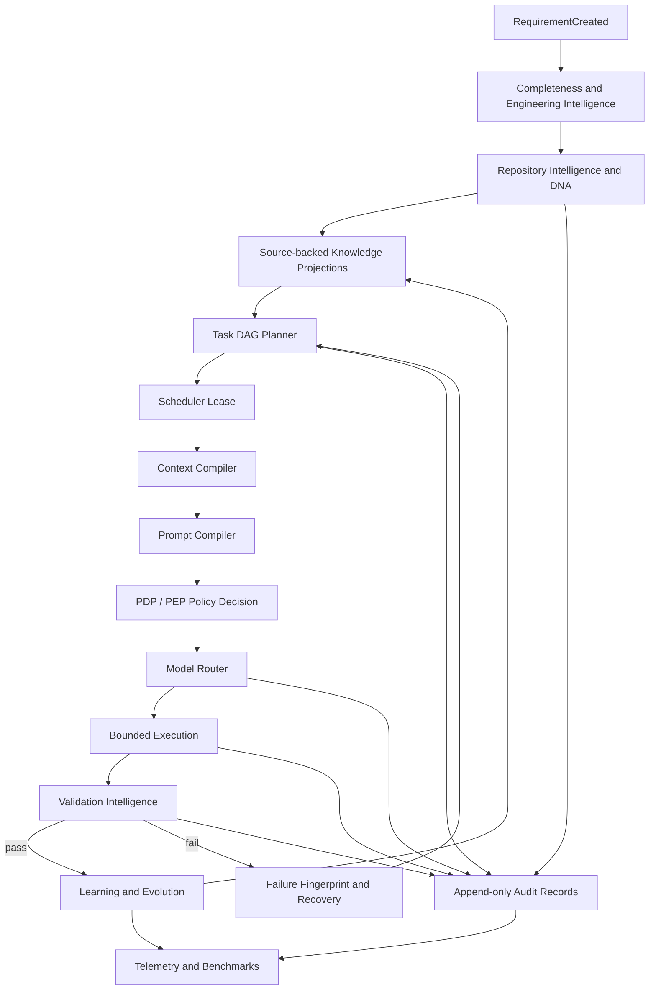

# System Flow

```mermaid
flowchart TD
  A["RequirementCreated"] --> B["Completeness and Engineering Intelligence"]
  B --> C["Repository Intelligence and DNA"]
  C --> D["Source-backed Knowledge Projections"]
  D --> E["Task DAG Planner"]
  E --> F["Scheduler Lease"]
  F --> G["Context Compiler"]
  G --> H["Prompt Compiler"]
  H --> P["PDP / PEP Policy Decision"]
  P --> I["Model Router"]
  I --> J["Bounded Execution"]
  J --> K["Validation Intelligence"]
  K -->|pass| L["Learning and Evolution"]
  K -->|fail| M["Failure Fingerprint and Recovery"]
  M --> E
  L --> D
  C --> N["Append-only Audit Records"]
  E --> N
  I --> N
  J --> N
  K --> N
  L --> O["Telemetry and Benchmarks"]
  N --> O
```
